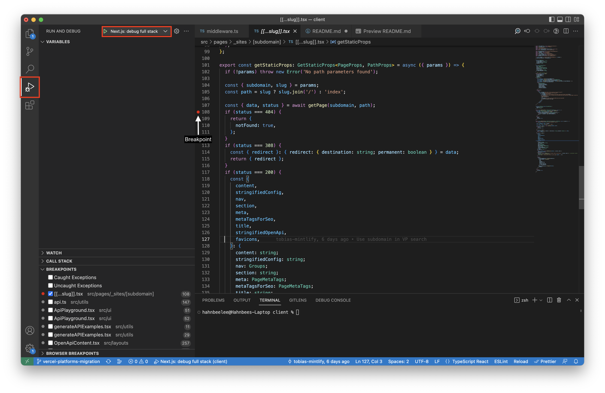

# Mintlify Client

The client is essentially a frontend template used to host documentation. In production, when `yarn prebuild` is ran it fetches all the relevant assets (the config file, the content (mdx files), and static assets) and plugs them into the appropriate locations before building.

## Your First Code Contribution

### Prerequisites

- Node v16.13.2 (npm v8.1.2)
- Yarn

### Dependencies

From a terminal, where you have cloned the repository, execute the following command to install the required dependencies:

```
yarn
```

### Local Testing

```
yarn dev
```

### Debugging in VS Code

Navigate to the VS Code debugger and select "Next.js: debug full stack"


Use the debugger to place breakpoints in your code to see your variable values. This is particularly useful for debugging the remark/rehype plugins because you can utilize it to see the abstract syntax tree (AST).

[Read more about debugging in VS Code](https://code.visualstudio.com/docs/editor/debugging)

### Formatting

This project uses [prettier](https://prettier.io/) for code formatting. You can run prettier across the code by calling `yarn run format` from a terminal.

To format the code as you make changes you can install the [Prettier - Code formatter](https://marketplace.visualstudio.com/items/esbenp.prettier-vscode) extension.

Add the following to your User Settings to run prettier:

```
"editor.formatOnSave": true,
"editor.defaultFormatter": "esbenp.prettier-vscode"
```

You can either modify the `settings.json` file or click on Preferences > Settings to use the UI.
